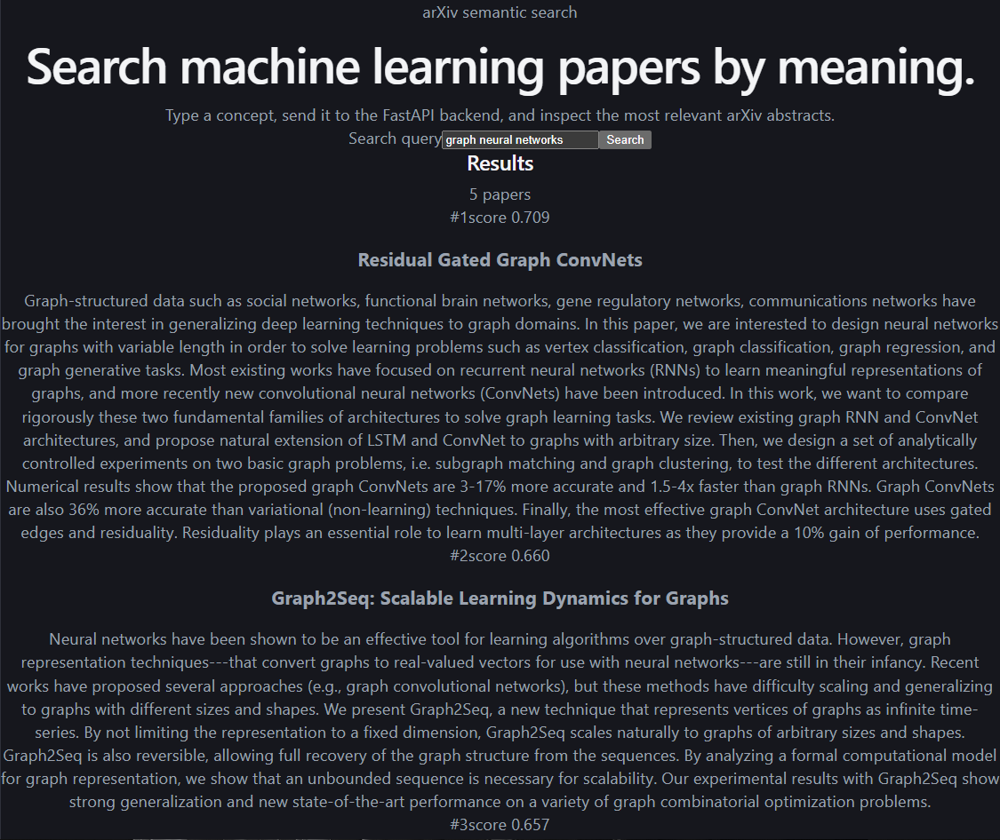

# arXiv Semantic Search

A semantic search engine over machine learning research papers. Type a natural-language query and get back the most conceptually relevant arXiv abstracts  - ranked by meaning, not keywords.

## Live demo

- **App:** https://arxiv-semantic-search.vercel.app
- **API:** https://arxiv-semantic-api.onrender.com/docs

> The backend runs on a free tier that sleeps after inactivity, so the **first search may take ~50 seconds** to wake the server. Subsequent searches are fast.

Unlike a keyword search, this finds papers even when they don't share your exact words. Searching `"neural networks for image classification"` returns papers about convolutional networks, MNIST, and classification architectures, because the search matches on *meaning*.

## Example

```
Search (or 'quit'): neural networks for image classification

Top 5 results for: neural networks for image classification

1. (score 0.681) Provably efficient neural network representation for image classification
   The state-of-the-art approaches for image classification are based on neural
   networks. Mathematically, the task of classifying images is equivalent to...

2. (score 0.590) Enhanced Image Classification With a Fast-Learning Shallow Convolutional Neural Network
   We present a neural network architecture and training method designed to
   enable very rapid training and low implementation complexity...
```

## How it works

The engine turns text into vectors and compares them geometrically:

1. **Embedding**  - each abstract is converted into a 384-dimensional vector using the `all-MiniLM-L6-v2` sentence-transformer. Semantically similar abstracts end up close together in this vector space.
2. **Indexing**  - all vectors are stored in a [FAISS](https://github.com/facebookresearch/faiss) `IndexFlatIP` index. Because the vectors are normalized to unit length, inner-product search is mathematically equivalent to cosine similarity.
3. **Querying**  - your search string is embedded the same way, and FAISS returns the nearest abstracts, ranked by similarity score.

## Architecture

The project separates building the index (slow, done once) from searching it (fast, done often):

```
src/arxiv_search/
    config.py      all tunable settings in one place
    embedder.py    text -> normalized vectors
    index.py       build / save / load / search the FAISS index
build_index.py     entry point: build the index once
search.py          entry point: interactive search
tests/             pipeline correctness tests
```

`build_index.py` embeds the abstracts and saves the index to `data/`. `search.py` loads that pre-built index and starts in about a second  - it never re-embeds the dataset.

## Setup

```bash
git clone https://github.com/madferuz/arxiv-semantic-search.git
cd arxiv-semantic-search

python3 -m venv venv
source venv/bin/activate        # Windows: venv\Scripts\activate

pip install -r requirements.txt
```

## Usage

Build the index once (downloads the dataset and embeds it  - the slow step):

```bash
python build_index.py
```

Then search as many times as you like:

```bash
python search.py               # default number of results
python search.py --top-k 10    # return 10 results per query
```

Type `quit` to exit.

## Configuration

Everything adjustable lives in `src/arxiv_search/config.py`: the model, how many
papers to index (`DATASET_SIZE`  - set to `None` for the full ~117K), the storage
paths, and the default result count.

## Tests

```bash
pytest
```

The tests verify the index build/save/load/search cycle, including the core
correctness property that a vector searched against itself ranks first with a
cosine score of 1.0. They use synthetic vectors, so they run fast and need no
model download.

## Evaluation

Retrieval quality is measured by `evaluate.py`, which runs a small set of
hand-labelled queries through the pre-built index and reports precision@k.
Ground truth maps each query to the row indices judged genuinely relevant.

```bash
python evaluate.py --top-k 5
```

Current result: **mean precision@5 = 0.467** across 3 queries.

One query (`transformer attention mechanism`) scores 0.00 by design  - the
20K-paper corpus predates the transformer literature, so there are no relevant
papers to retrieve. It's kept in the eval set as an honest example of a corpus
limitation rather than a model failure.

## Tech stack
- **FastAPI**  - backend API
- **React + Vite**  - frontend
- **Docker**  - containerizes the backend
- **Render** / **Vercel**  - backend / frontend hosting
- **[sentence-transformers](https://www.sbert.net/)**  - embedding model (`all-MiniLM-L6-v2`)
- **[FAISS](https://github.com/facebookresearch/faiss)**  - vector index and similarity search
- **[Hugging Face `datasets`](https://huggingface.co/datasets/CShorten/ML-ArXiv-Papers)**  - source data (build-time only, not a runtime dependency)
- **pandas**, **pytest**, **Python 3.12**

## Roadmap

- [ ] Scale to the full ~117K-paper dataset
- [ ] Add result filtering by category or year
- [x] Web UI (React + FastAPI, deployed - see Live demo above)
